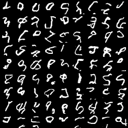
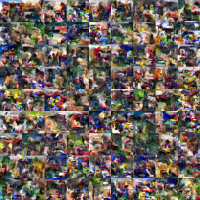
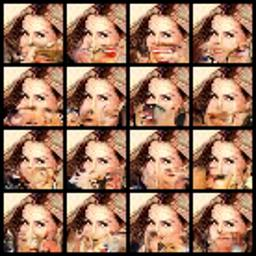

# Overview
Naive reimplemenatiton of [PixelCNN](https://arxiv.org/abs/1601.06759v3) model in Pytorch.

## Installation
```
pip install -U pixelcnn
```

## Generating images
```python
from pixelcnn.infer import InferModel, INFER_CONFIGS

# Load model
checkpoint_path=<path-to-mnist-checkpoint>
config = INFER_CONFIGS["mnist"]
model = InferModel(config, checkpoint_path)

# Generate MNIST images
mnist_images = model.generate(num_images=81)
```

```python
from pixelcnn.infer import InferModel, INFER_CONFIGS

# Load model
checkpoint_path=<path-to-cifar10-checkpoint>
config = INFER_CONFIGS["cifar10"]
model = InferModel(config, checkpoint_path)

# Generate Cifar10 images
cifar_images = model.generate(num_images=81)
```


## Image completion
Model can be used to complete occluded images.

```python
from pixelcnn.infer import InferModel, INFER_CONFIGS
import torch

def load_image(path: str) -> np.ndarray:
    image = cv2.imread(path)
    image = cv2.cvtColor(image, cv2.COLOR_BGR2RGB)

    return image

# Load model
checkpoint_path=<path-to-celeba-checkpoint>
config = INFER_CONFIGS["celeba"]
model = InferModel(config, checkpoint_path)

# Load image
image = load_image("../assets/celeba_example.jpeg")
occluded_image = torch.tensor(image).permute(2, 0, 1) / 255.0
occluded_image[:, 20:] = -1

# Generate completions
completed = model.autocomplete(occluded_image, num_images=16)
```


*Original image*


*Occluded image*



*Completion examples*

## Model training
### Setup Environment
Two ways to setup environment:

1. Install requirements from `requirements.txt`
2. Dockerfile

### Edit Config
Edit configs/config.yaml. Main options to choose: 
- dataset: "mnist", "cifar10" or "celeba"
- artifacts_path: where to store artifacts
- exp_name: experiment name

### Train model
```
python src/train.py
```

## References
1. [PixelCNN paper](https://arxiv.org/abs/1601.06759v3)
2. [Original implementation by OpenAi](https://github.com/openai/pixel-cnn)
2. [Tutorial by Sergei Turukin](https://sergeiturukin.com/2017/02/22/pixelcnn.html)
3. [Another implementation by Hrituraj Singh](https://github.com/singh-hrituraj/PixelCNN-Pytorch)